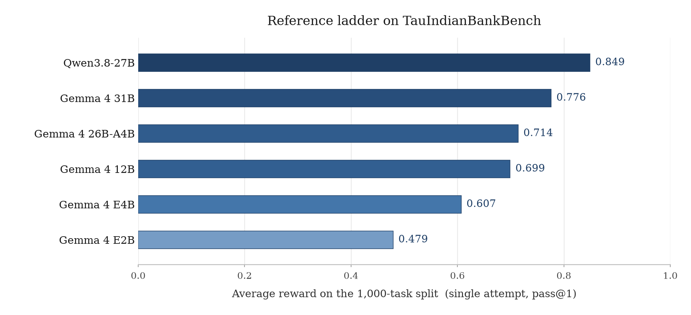

# TauIndianBankBench: an Indian retail-banking benchmark for tool-using conversational agents

[](https://www.python.org/)
[](LICENSE)
[](https://huggingface.co/datasets/NPCI/tau-indian-banking)
[](https://github.com/sierra-research/tau2-bench)

The benchmark measures how well a language model handles a bank's customer chat.
The model under test plays the bank's assistant. A second model plays the
customer, who opens the conversation with a real request: block a lost card,
book a fixed deposit, cancel a standing instruction, or ask what it costs to
close a deposit early.

To settle the request the assistant has to look up the customer's records,
follow the bank's written policy, and call the right tools in the right order,
over as many turns as the conversation takes. It has 33 banking tools and one
tool that hands the customer to a human. An episode passes only if the bank's
database ends up in the expected state and the required tool calls were made,
so scoring does not depend on how the answer was worded.

The suite has 1000 such tasks over a synthetic bank, and the repository is
self-contained: it bundles the domain, the task suite and the
[tau2-bench](https://github.com/sierra-research/tau2-bench) harness it is built
on. Installing it gives you a `tau2` command that runs and scores the benchmark
against any OpenAI-compatible endpoint.

All data in this benchmark is synthetic and the benchmark is for research and
evaluation only; see the [disclaimer](DISCLAIMER.md).

- [Install](#install)
- [Quick start](#quick-start)
- [What the benchmark measures](#what-the-benchmark-measures)
- [The domain](#the-domain)
- [Scenario families and splits](#scenario-families-and-splits)
- [Running](#running)
- [Serving a local model](#serving-a-local-model)
- [Hosted APIs](#hosted-apis)
- [Reference results](#reference-results)
- [Reporting scores](#reporting-scores)
- [Scoring and inspection](#scoring-and-inspection)
- [Prompts and overrides](#prompts-and-overrides)
- [Layout](#layout)
- [Testing](#testing)
- [Synthetic data notice](#synthetic-data-notice)
- [Disclaimer](#disclaimer)
- [Licence](#licence)
- [Citation](#citation)

## Install

Python 3.12 or 3.13 on Linux, macOS or Windows. On Windows activate the
virtualenv with `.venv\Scripts\activate` and run the commands from PowerShell so
the quoted JSON arguments pass through unchanged.

The domain data (tasks, database, policy, knowledge base, user-simulator
guideline) is hosted on Hugging Face as
[`NPCI/tau-indian-banking`](https://huggingface.co/datasets/NPCI/tau-indian-banking)
rather than in this repository, and the package bundles it at build time, so
fetch the data before installing the package.

With `pip` (`requirements.txt` pins the same versions):

```bash
python3.12 -m venv .venv && source .venv/bin/activate
pip install -r requirements.txt
python scripts/fetch_data.py          # set HF_TOKEN first if the dataset is private
pip install --no-deps -e .
```

With `uv` (the lock file is included):

```bash
uv sync --no-install-project
uv run python scripts/fetch_data.py
uv sync
```

Under `uv`, prefix every `tau2` command below with `uv run`.

## Quick start

```bash
tau2 domain indian_banking                 # serves policy + tool docs at http://127.0.0.1:8004/redoc
tau2 run --domain indian_banking ...       # the full command is under Running
python scripts/score.py data/simulations/<run>/results.json
```

## What the benchmark measures

Each task is one conversation. A user simulator plays the customer from a
scripted scenario; the agent under test talks to them and calls tools. When the
conversation ends, the episode is scored on two checks, and the reward is 1.0
only if both pass:

| Check | What it compares |
| --- | --- |
| **DB** | the bank's database after the conversation must equal the one produced by replaying the task's gold actions, an end-state check, so a wrong write is not repaired by a later correct one |
| **ACTION** | every gold action must appear in the trajectory with matching arguments, and every *write* the agent performed must correspond to a gold write; an unrequested mutation fails the episode |

There is no partial credit, and the reward needs no judge model: every task's
`reward_basis` is `["ACTION", "DB"]`.

Two further checks run alongside and are recorded in each episode's
`reward_info` without affecting the score:

| Check | What it does |
| --- | --- |
| **COMMUNICATE** | flags an episode in which the agent exposes tool names, API field names or internal category codes to the customer (`communicate_checks`) |
| **NL_ASSERTION** | every task carries a natural-language statement of correct handling (`evaluation_criteria.nl_assertions`, e.g. "blocks the card exactly once after confirmation and declines to block it a second time"); evaluated by an LLM judge only when `TAU2_NL_JUDGE_MODEL`, `TAU2_NL_JUDGE_API_BASE` and `TAU2_NL_JUDGE_API_KEY` are set, otherwise skipped; useful for error analysis and for `tau2 evaluate-trajs` |

The DB check depends on determinism: the domain runs on a frozen clock
(2026-07-16, the date the policy states) and derives every server-assigned
reference from a fixed seed plus the content of the call, so replaying the same
actions in a second process yields the same database, byte for byte.

## The domain

| | |
| --- | --- |
| Tasks | 1000, across 50 scenario families |
| Tools | 33 banking tools + `transfer_to_human_agents` |
| Customers | 944 in the shipped database |
| Knowledge base | 24 markdown documents, 79 searchable sections |
| Policy | `data/tau2/domains/indian_banking/policy.md` |

The tools cover accounts and transactions; fixed and recurring deposits
(quotes, booking, premature closure, renewal instructions); loans with EMI,
foreclosure and gold-LTV calculators; debit and credit cards (freeze, block,
per-channel controls); UPI and other mandates; cheque services; statements;
address updates; service requests; insurance policies; and product offers.

`search_knowledge_base` is a keyword search over the markdown corpus in
`data/tau2/domains/indian_banking/kb/` holds regulatory and product material on UPI
limits, KYC periodicity, deposit insurance, TDS on FD interest, chargeback
timelines, dormant accounts, positive pay and related topics. Ten of the 24
documents are drawn from named public sources, recorded with source URLs,
retrieval date and publisher in `kb/provenance.json`; the other fourteen are
written for the domain. No model or vector index is involved.

## Scenario families and splits

| Family prefix | Tasks | Scenario |
| --- | --- | --- |
| `hp*` | 112 | happy paths |
| `sq*`, `sq2*` | 470 | ordered multi-step requests; the customer insists one step completes before the next |
| `edga*`, `edgb*` | 266 | edge cases where the right answer is often to refuse, to ask, or to pick the reversible action |
| `tl*` | 152 | ordered lookup chains: a run of read-only details, then the one action that follows from them |

| Split | Tasks | Use |
| --- | --- | --- |
| `base` | 1000 | the whole suite; report this |
| `lite` | 200 | a faster representative subset |
| `train` | 150 | for tuning, if you tune |
| `test` | 50 | a small held-out slice |

`lite` is exactly `train` ∪ `test`, and the two are disjoint. Splits are declared
in `data/tau2/domains/indian_banking/split_tasks.json`. Numbers from different
splits are not comparable; say which one you ran.

## Running

The benchmark needs two OpenAI-compatible endpoints: the **agent** under test
(must support tool calling) and the **user simulator** that plays the customer.
They may be the same endpoint. The reference settings:

| Setting | Value |
| --- | --- |
| Split | `base` (all 1000 tasks) |
| Trials per task | 1 |
| Agent | temperature 0.0, `max_tokens` 8192 |
| User simulator | temperature 0.0, `max_tokens` 8192 |
| Max steps per episode | 200 |
| Max tool errors per episode | 10 |
| Context length | at least 32768 tokens |

```bash
tau2 run --domain indian_banking \
  --agent-llm openai/<agent-model-name> \
  --agent-llm-args '{"api_base": "http://localhost:8000/v1", "api_key": "dummy", "temperature": 0.0, "max_tokens": 8192}' \
  --user-llm openai/<user-sim-model-name> \
  --user-llm-args '{"api_base": "http://localhost:8001/v1", "api_key": "dummy", "temperature": 0.0, "max_tokens": 8192}' \
  --task-split-name base \
  --num-trials 1 \
  --max-steps 200 \
  --max-errors 10 \
  --max-concurrency 10 \
  --save-to indian_banking_base_run1 \
  --auto-resume
```

The model name after `openai/` must match the name the server reports (for
vLLM, its `--served-model-name`). `--auto-resume` lets a re-run with the same
`--save-to` continue where it stopped. Concurrency affects speed only. Results
land in `data/simulations/<save-to>/results.json`.

## Serving a local model

Open-weights models are best served with vLLM, image
`vllm/vllm-openai:v0.25.0`, with the model family's built-in tool-call parser
(`--enable-auto-tool-choice --tool-call-parser <family>`, e.g. `gemma4`,
`qwen3_xml`) and a context window of at least 32768 tokens. The agent requests
up to 8192 output tokens per turn.

## Hosted APIs

Models are addressed through [litellm](https://docs.litellm.ai/docs/providers),
so any provider it supports can play the agent, the user simulator, or both.
Use the provider's model-id prefix, drop `api_base` and `api_key` from the
arguments, and put the provider's key in the environment or in a `.env` file in
the checkout root, which `tau2` loads automatically.

| Provider | Model id | Key |
| --- | --- | --- |
| OpenRouter | `openrouter/<vendor>/<model>` | `OPENROUTER_API_KEY` |
| OpenAI | `openai/<model>` (no `api_base`) | `OPENAI_API_KEY` |
| Anthropic | `anthropic/<model>` | `ANTHROPIC_API_KEY` |
| Google AI Studio | `gemini/<model>` | `GEMINI_API_KEY` |
| Any OpenAI-compatible server | `openai/<served name>` with `api_base` and `api_key` in the arguments | as the server requires |

An OpenRouter-hosted agent against a locally served user simulator:

```bash
export OPENROUTER_API_KEY=...
tau2 run --domain indian_banking \
  --agent-llm openrouter/<vendor>/<model> \
  --agent-llm-args '{"temperature": 0.0, "max_tokens": 8192}' \
  --user-llm openai/<user-sim-model-name> \
  --user-llm-args '{"api_base": "http://localhost:8001/v1", "api_key": "dummy", "temperature": 0.0, "max_tokens": 8192}' \
  --task-split-name base --num-trials 1 --max-steps 200 --max-errors 10 \
  --max-concurrency 4 --save-to indian_banking_base_openrouter --auto-resume
```

Before running a metered API over the full suite: the provider must support
tool calling for the model you pick, and each conversation resends its growing
context every turn, so a 1000-task run costs far more than a single request
suggests. Run `--num-tasks 5` first, check the provider's usage, and extrapolate.

## Reference results

Six models scored on the full 1,000-task split, each against the same user
simulator (MiniMax-M2.7), at temperature 0. The numbers are single pass (pass@1): every task
is attempted once, with no retries and no best-of-n selection. The average
reward is a pass rate, because each task scores 1 (all required actions made
and the correct final records) or 0, so the average is the fraction of tasks
passed on that single attempt.



Per-category reward is where the aggregate breaks down. Seq is the sequencing
category (several actions in a fixed order); Edge is the edge cases where the
correct move is often to refuse or to ask; Tools is coverage of the rarely used
tools; Ctrl is the control category of straightforward requests, expected to
stay flat across model size. Seq, Edge and Tools are the harder categories.

| Agent model | All | Seq | Edge | Tools | Ctrl |
|---|---|---|---|---|---|
| Qwen3.8-27B | 0.849 | 0.921 | 0.774 | 0.757 | 0.848 |
| Gemma 4 31B | 0.776 | 0.868 | 0.718 | 0.559 | 0.821 |
| Gemma 4 26B-A4B | 0.714 | 0.802 | 0.662 | 0.500 | 0.759 |
| Gemma 4 12B | 0.699 | 0.732 | 0.639 | 0.533 | 0.929 |
| Gemma 4 E4B | 0.607 | 0.662 | 0.500 | 0.480 | 0.804 |
| Gemma 4 E2B | 0.479 | 0.455 | 0.426 | 0.388 | 0.830 |

## Reporting scores

A score from this benchmark is a property of the whole loop, not of the agent
alone: the model playing the customer shapes every conversation, so the same
agent scores differently under different user simulators, and any change to the
user simulator, its guidelines, the policy, the tasks or the database produces
a different number. Report the agent, the user simulator and the split
together, and compare only runs that share all three.

Numbers also carry run-to-run variance. Temperature 0 does not make a run
reproducible episode by episode: a model served with batched inference can pick
a different token when the same prompt arrives in a different batch, and one
different early token sends a multi-turn conversation down a different path.
Between repeated runs of the same configuration, roughly 15–25% of episodes flip
between pass and fail in both directions, while the 1000-task mean moves by
about ±1–2 points. Treat a single run as a measurement with that band around
it; a point or two between two models, or between two runs of the same model,
is not significant. For a tighter estimate run several trials
(`--num-trials 3`), or compare two runs on their shared tasks with
`scripts/score.py --compare`.

## Scoring and inspection

```bash
python scripts/score.py data/simulations/<run>/results.json     # strict mean, per-category means, termination profile
python scripts/score.py --compare RUN_A/results.json RUN_B/results.json   # two runs on the tasks they share
tau2 view                                                      # browse recorded conversations
tau2 evaluate-trajs data/simulations/<run>/results.json        # re-score recorded trajectories
tau2 check-data                                                # verify the data directory resolves
```

`score.py` uses only the standard library, so it also runs outside the
benchmark's virtualenv.

## Prompts and overrides

The agent's system prompt is `agent_instruction.txt` wrapped in
`<instructions>`, followed by `policy.md` wrapped in `<policy>`; the user
simulator reads `data/tau2/user_simulator/simulation_guidelines.md`. All three
ship with the domain and are used by default.

| Variable | Effect |
| --- | --- |
| `TAU2_AGENT_INSTRUCTION_FILE` | substitute the agent instruction block |
| `TAU2_USER_SIM_GUIDELINES_FILE` | substitute the user-simulator guidelines |
| `TAU2_DATA_DIR` | read `data/` from, and write `data/simulations/` to, another directory |
| `TAU2_NL_JUDGE_MODEL`, `TAU2_NL_JUDGE_API_BASE`, `TAU2_NL_JUDGE_API_KEY` | enable the NL_ASSERTION judge |
| `TAU2_DOC_HOST`, `TAU2_DOC_PORT` | where `tau2 domain` serves its documentation |
| provider keys | e.g. `OPENAI_API_KEY`, `OPENROUTER_API_KEY`, from the environment or `.env` |

The harness looks for `data/` next to the sources, falls back to the copy inside
the installed package, and lets `TAU2_DATA_DIR` override both.

## Layout

```
src/tau2/                       tau2-bench harness (agent, user simulator,
                                orchestrator, evaluator, runner, CLI)
src/tau2/domains/indian_banking/
    environment.py              domain registration and task loading
    tools.py                    the 33 banking tools plus the transfer tool, as a tau2 ToolKit
    service.py                  the banking implementation behind them
    data_model.py               database schema and its hash
    customer_facing.py          the COMMUNICATE check
data/tau2/domains/indian_banking/   (fetched by scripts/fetch_data.py)
    tasks.json                  1000 tasks
    split_tasks.json            split definitions
    db.json                     the bank's initial state
    policy.md                   the policy the agent must follow
    agent_instruction.txt       the instruction block preceding the policy
    kb/                         the knowledge-base corpus
data/tau2/user_simulator/       the guidelines the simulated customer follows
scripts/score.py                scoring helper
scripts/fetch_data.py           downloads the domain data from Hugging Face
tests/                          domain and harness tests
```

## Testing

The tests read the domain data, so run `python scripts/fetch_data.py` first.

```bash
uv sync --extra dev && uv run pytest      # with uv
pip install -e ".[dev]" && pytest         # with pip
```

## Synthetic data notice

Every customer, account, card, deposit, loan, mandate, transaction, address,
e-mail address, phone number, employer and scenario in this benchmark is
synthetic, generated for evaluation purposes. The bank itself is fictional. Any
resemblance to real persons, living or dead, or to actual accounts, products or
events is coincidental. Where names of companies, payees or institutions appear
in the data, they are generic references that make scenarios read naturally;
nothing in this repository describes any real organisation's products,
customers, transactions or policies, and no affiliation or endorsement is
implied. The knowledge-base articles paraphrase publicly available regulatory
and product information for the sole purpose of grounding the simulated agent;
they are not advice and should not be relied upon.

## Disclaimer

This benchmark is provided for research, testing and benchmarking only, on an
"as is" basis and without warranties of any kind. Nothing in it is legal,
regulatory, compliance, financial, banking, risk, security or professional
advice, and it should not be relied upon for operational, customer-facing or
production decisions. The full terms, including the limitation of liability and
the position on trademarks, are in [DISCLAIMER.md](DISCLAIMER.md).

## Licence

MIT. The harness in `src/tau2/` and the `LICENSE` file at the repository root
come from tau2-bench and carry its copyright notice; the `indian_banking`
domain, its tasks and data are released by their authors under the same licence.

## Citation

If you use this benchmark, please cite it together with the tau2-bench and
tau-bench papers it builds on. `CITATION.cff` carries the same entries in
machine-readable form.

```bibtex
@software{npci2026tauindianbankbench,
  title   = {TauIndianBankBench: an Indian retail-banking benchmark for tool-using conversational agents},
  author  = {Adhikary, Krishanu and Devadiga, Prashant},
  organization = {NPCI AI Research Team},
  year    = {2026},
  version = {1.0.0},
  note    = {A $\tau^2$-bench domain: 1000 tasks across 50 scenario families, 34 tools, strict end-state scoring}
}

@misc{barres2025tau2bench,
  title         = {$\tau^2$-Bench: Evaluating Conversational Agents in a Dual-Control Environment},
  author        = {Victor Barres and Honghua Dong and Soham Ray and Xujie Si and Karthik Narasimhan},
  year          = {2025},
  eprint        = {2506.07982},
  archivePrefix = {arXiv},
  primaryClass  = {cs.AI},
  url           = {https://arxiv.org/abs/2506.07982}
}

@misc{yao2024taubench,
  title         = {$\tau$-bench: A Benchmark for Tool-Agent-User Interaction in Real-World Domains},
  author        = {Shunyu Yao and Noah Shinn and Pedram Razavi and Karthik Narasimhan},
  year          = {2024},
  eprint        = {2406.12045},
  archivePrefix = {arXiv},
  primaryClass  = {cs.AI},
  url           = {https://arxiv.org/abs/2406.12045}
}
```
